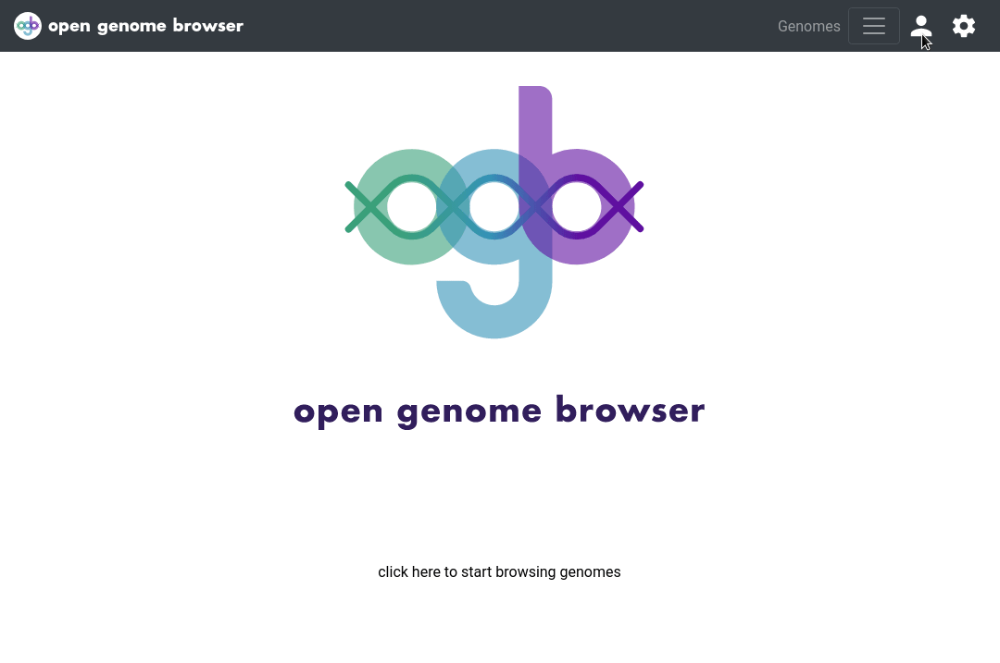

<link rel="shortcut icon" type="image/svg+xml" href="/opengenomebrowser/favicon.svg">

# Admin panel

The admin panel enables certain users to change the metadata in the database:

- [upload and import new genomes](upload-genome.md)
- change metadata associated with organisms (e.g.: change TaxId)*
- change metadata associated with genomes*
- edit markdown files ([organism.md and genome.md](../documentation/folder_structure_and_metadata.md#organismmd-and-genomemd))
- create new tags and edit their descriptions
- add new TaxIDs

*: any changes are immediately updated in the corresponding `genome.json` or `organism.json` and a backup is made.

This feature allows users of OpenGenomeBrowser without UNIX skills to modify or expand metadata without having to bother the system administrator.

Currently, four _roles_ exist:

- **Anonymous** (no login): can only see content if OpenGenomeBrowser is configured with `LOGIN_REQUIRED=false` in
  the [environment file](https://github.com/opengenomebrowser/opengenomebrowser-docker-template/blob/main/production-template.env)
- **Registered**: Can user OpenGenomeBrowser even if `LOGIN_REQUIRED=false`
- **Staff**: Can log into the admin panel and perform actions if superusers give them permissions
- **Superuser**: Can log into the admin panel, has all permissions, can create users and give them permissions

