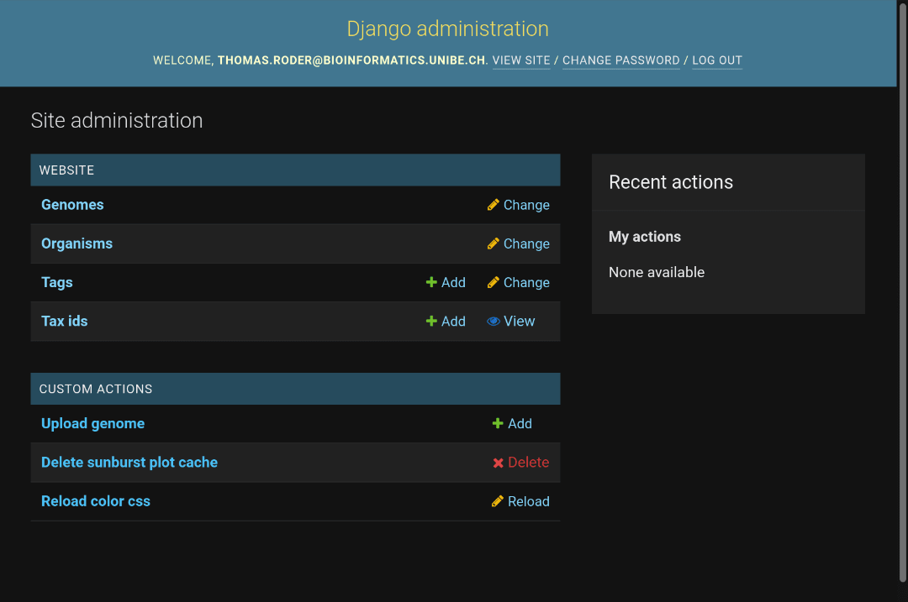

<link rel="shortcut icon" type="image/svg+xml" href="/favicon.svg">

# Upload and import genomes

Via the admin panel, users with the permissions `website.add_genome` and `website.add_organism` may upload new genomes to OpenGenomeBrowser.

A brief demo:

At least, three files are required:

- `.fna`: assembly (FASTA)
- `.gbk`: GenBank file
- `.gff`: General feature format file

This page uses the `import_genome` function of [opengenomebrowser-tools](https://github.com/opengenomebrowser/opengenomebrowser-tools#import_genome),
so read the documentation there to learn what else is possible.