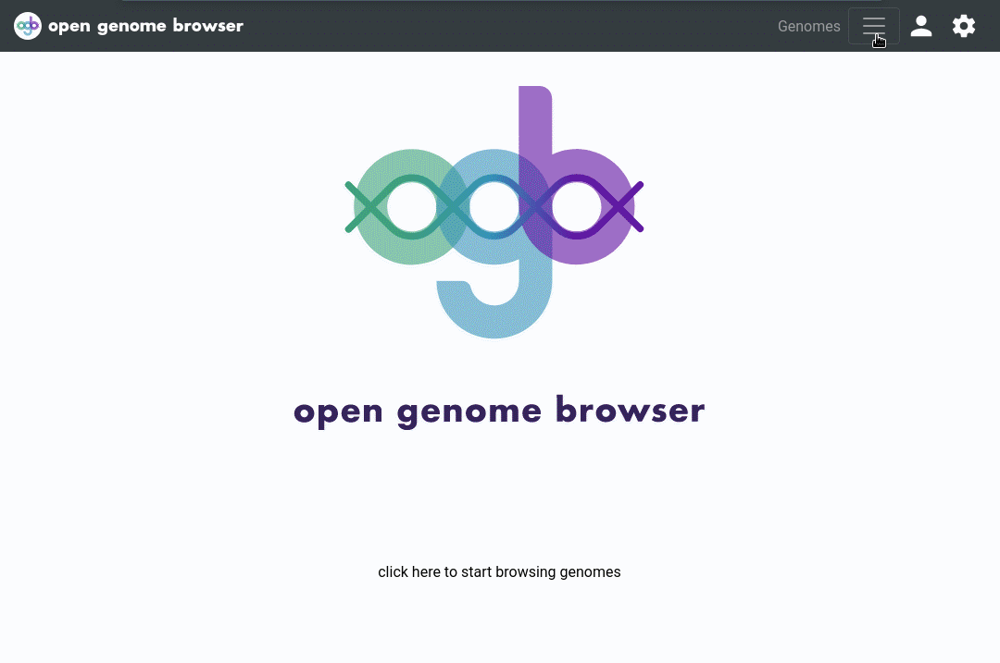

<link rel="shortcut icon" type="image/svg+xml" href="/favicon.svg">

# Annotation search

This page allows one to quickly see which genomes cover which annotations, and to go further to explore the genes.

Click [here](https://opengenomebrowser.bioinformatics.unibe.ch/annotation-search/?annotations=EC%3A2.4.1.18+FAD-dependent!!!oxidoreductase+GO%3A0008989+K00231+R02120&genomes=%40tax%3ABacteria)
for an example.

## Usage

Open the [Annotation search](https://opengenomebrowser.bioinformatics.unibe.ch/annotation-search/) page via the `Tools` drop-down menu.

Enter annotations of interest into the top box and the genomes to search through into the lower one, then click on `Submit`.
(Note: consider using [_magic strings_](../tutorials/magic-strings.md)!)

This will load a _coverage matrix_. Each row is a genome and each column is an annotation.

The numbers in the cells tell you how many genes of the genome cover the annotation. A click on a number will show you
these [genes](../tutorials/gene.md).

To download the table, open the settings sidebar (click on the settings wheel) and click on `coverage-matrix.tsv` (numeric table) or `coverage-matrix-genes.tsv` (table with gene identifiers).

Hint: A click on an annotation will open a context menu with more options, for example a link to the [`compare genes`](../tutorials/compare-genes.md) page.

