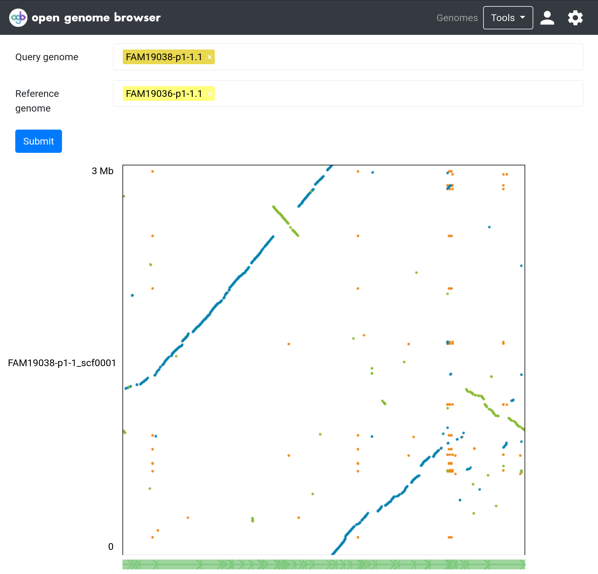

<link rel="shortcut icon" type="image/svg+xml" href="/opengenomebrowser/favicon.svg">

# Dotplot

Dotplot enables users to compare two assemblies. It is useful to find similar and repetitive regions as well as structural variation.

**Hint:** It may also be useful to align an assembly with itself!

## How to get there

In the [genome table](https://opengenomebrowser.bioinformatics.unibe.ch/genomes), select exactly two genomes (using `Shift` or `Ctrl`) and open the
context menu using right click. Then, click on "Compare the assemblies using dotplot".

Click [here](https://opengenomebrowser.bioinformatics.unibe.ch/dotplot/?ref=FAM19036-p1-1.1&query=FAM19038-p1-1.1) for an example.

## Usage

Zoom:

- Click and drag to zoom in
- Double-click to zoom out

Colors (default):

- blue: forward alignments
- green: reverse alignments
- orange: repetitive alignments

## How it works

First, the assemblies are aligned using `nucmer` (part of the [mummer4](https://mummer4.github.io/) package). Then, the interactive dot plot
viewer [Dot](https://github.com/MariaNattestad/dot) is used to visualize and animate the result.

## Parameters

The most important parameter is `nucmer`s `mincluster` parameter. It sets the minimum length of a cluster. A higher value will decrease the
sensitivity of the alignment, but will also result in more confident results.

In the settings sidebar (click on the settings wheel), many options are available to change the looks of the plot.
