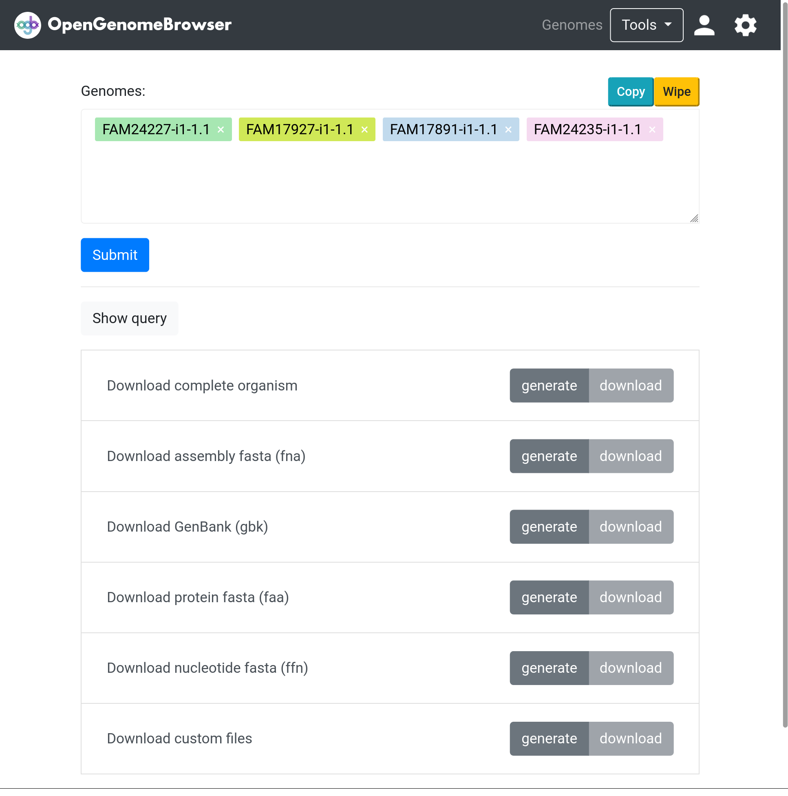

<link rel="shortcut icon" type="image/svg+xml" href="/opengenomebrowser/favicon.svg">

# Download genome-associated files conveniently

OpenGenomeBrowser makes it easy to download multiple genome-associates files in batch.

Simply click on `Downloader` in the `Tools` dropdown.

