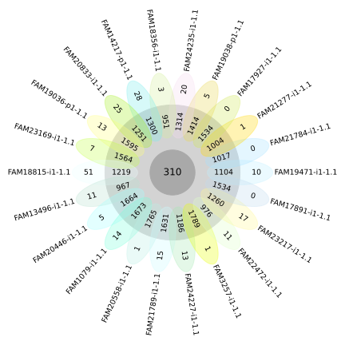

<link rel="shortcut icon" type="image/svg+xml" href="/opengenomebrowser/favicon.svg">

# Flower plot

Flower plots give insight into the number of annotations that are shared between a set of genomes.

This tool allows one to see:

- the annotations that occur in all genomes (core, in gray)
- the annotations that are shared with at least one of the other genomes (inner numbers of flower petals)
- the annotations that are unique to each genome (outer numbers of flower petals)

## Usage

The [flower plot page](https://opengenomebrowser.bioinformatics.unibe.ch/flower-plot/) can be accessed by a right click on a selection of multiple
genomes the genome table or from the drop-down menu 'Tools' on the top right of the genome table page.

The input consists of multiple of genomes. By default, the flower plot is based on orthologous genes. The annotation category can be changed via the
settings wheel.

Click on outer numbers of flower petals to proceed to the list of unique annotations.

Click on the core genome (gray) to proceed to the list of annotations that are shared by all genomes.

Example: [Click here](https://opengenomebrowser.bioinformatics.unibe.ch/flower-plot/?genomes=%40tax%3ABacteria&anno_type=OL).
