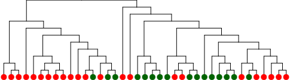

<link rel="shortcut icon" type="image/svg+xml" href="/favicon.svg">

# Gene trait matching

Gene-trait matching is an effective approach to identify genes that could be responsible for an observed phenotype.

The principle is simple: If one group of genomes has a specific trait that another does not, search for orthologous genes (or functional annotations)
that occur in one group and are absent in the other.

## Usage

Open the [gene trait matching page](https://opengenomebrowser.bioinformatics.unibe.ch/gene-trait-matching/) and enter two non-intersecting groups of
genomes, for example:
[Lactobacillaceae vs Propionibacteriaceae and Streptococcaceae](https://opengenomebrowser.bioinformatics.unibe.ch/gene-trait-matching/?method=fast-fisher&alpha=0.2&anno_type=OL&multiple_testing_method=fdr_bh&g1=%40taxfamily%3ALactobacillaceae&g2=%40taxfamily%3AStreptococcaceae+%40taxfamily%3APropionibacteriaceae)
.

The resulting table can be downloaded in CSV format through the settings sidebar.

## Example use case

The following example is based on a real experiment with 39 strains from the same microbial genus. 23 strains can metabolise a specific compound
(green), the others (red) can not.

To find the responsible gene(s), open the [gene-trait-matching view](https://opengenomebrowser.bioinformatics.unibe.ch/gene-trait-matching/), define
the two groups of genomes, and click on 'Submit'.

In this case, gene-trait matching found a strong correlation of the trait with a small number of orthologs. A closer look indicated that these
orthologous genes were always located close to each other on the genome. A follow-up RNA-Seq experiment also showed a link between the phenotype and
this gene cluster.

This experiment was ideal for gene-trait matching because the strains were relatively closely related and the trait was distributed amongst different
clusters. If this is not the case, gene-trait matching is less likely to work. For example, had the phenotype been strongly correlated with the
phylogenetic clusters, like in the image below, too many genes would probably have shown up as significantly different between the two groups.

## Background

By default, OpenGenomeBrowser will run a [Fisher's exact test](https://en.wikipedia.org/wiki/Fisher%27s_exact_test) for each orthologous gene and
apply Benjamini/Hochberg multiple testing correction (alpha = 10 %).

**Caution:** It is not guaranteed that the assumption of Fisher’s test, that _all isolates have a random and independently distributed probability for
exhibiting each state_, is valid because of population structure. See the example above. For more information, read the
paper [Brynildsrud et al, Genome Biol, 2016](https://genomebiology.biomedcentral.com/articles/10.1186/s13059-016-1108-8) about
the [Scoary](https://github.com/AdmiralenOla/Scoary/tree/master/scoary) tool.

(In the future, I will probably implement something like Scoary's empirical p-value as an additional output column.)

## Advanced usage

In the settings sidebar (weel on top right), it is possible to change...

- test method
    - `fast-fisher`: Faster, custom implementation of Fisher's exact test. Original algorithm
      by [painyeph](https://github.com/painyeph/FishersExactTest), Cython implementation by
      me ([Thomas Roder](https://github.com/MrTomRod/fast-fisher))
    - `fisher`: Reference implementation in the [scipy](https://docs.scipy.org/doc/scipy/reference/generated/scipy.stats.fisher_exact.html) library,
      should give almost exactly the same result as `fast-fisher`, but about 100x slower than `fast-fisher`
    - `boschloo`: [Boschloo's exact test](https://en.wikipedia.org/wiki/Boschloo's_test) is a more powerful variant of Fisher's exact test that can be
      used when the column sums of the contingency table are known in advance, which is the case here (the column sums are the total number of genomes
      that have or lack the trait). While the p-values may be less
      conservative, [benchmarks on simulated data](https://github.com/AdmiralenOla/Scoary/issues/96) indicate that Fisher's test is a better method to
      rank the genes.
- the category of annotations to use
- the multiple testing algorithm
- the associated alpha value

