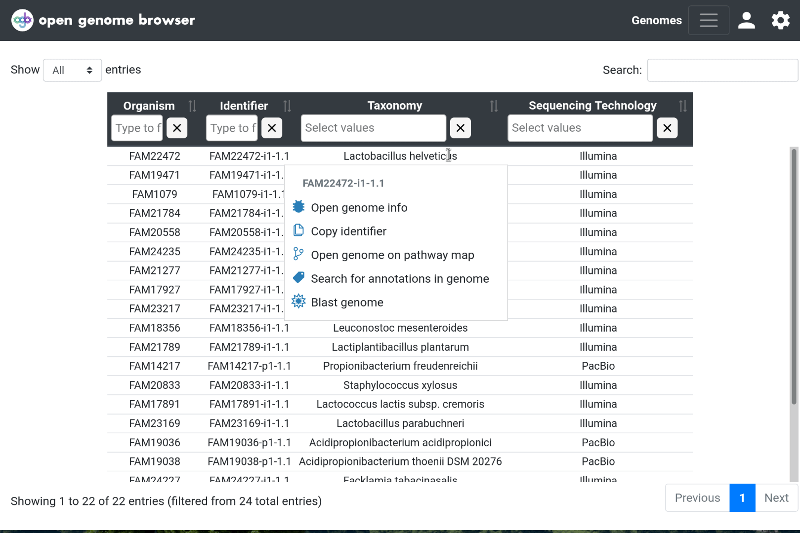

<link rel="shortcut icon" type="image/svg+xml" href="/opengenomebrowser/favicon.svg">

# Single genome view

This page contains all metadata that was fed into OpenGenomeBrowser for this particular genome.

On this page, you can...

- view the metadata
- download associated files

## Content

In the [genome table](https://opengenomebrowser.bioinformatics.unibe.ch/genomes), right-click on a row and
select [`Open genome info`](https://opengenomebrowser.bioinformatics.unibe.ch/genome/FAM18356-i1-1.1/).

The metadata is organized in sections (key parameters, sequencing information, etc.). Click on the section title bar to expand it.

Links to the associated files are listed at the bottom of the page:

- Assembly
- Coding sequences (gbk, faa, ffn, gbk)
- Annotation files (eggnog, tab-separated format)

