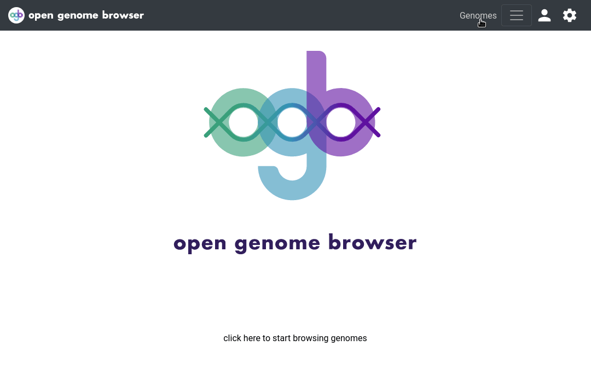

<link rel="shortcut icon" type="image/svg+xml" href="/opengenomebrowser/favicon.svg">

# Genome table

The [genome table](https://opengenomebrowser.bioinformatics.unibe.ch/genomes) is the ideal place to start exploring OpenGenomeBrowser and its
genomes.

On this page you can...

- search the genome database
- apply filters
- sort by column
- forward selected genomes to further analysis
- add or remove metadata columns (settings panel)
- download the table in xlsx or csv format (settings panel)

## Usage

To dive deeper into a genome, open the context menu by clicking on a genome or by right-clicking on a row.

It is possible to select **multiple** genomes by holding down `Shift` and/or `Ctrl` while clicking on rows.

If multiple genomes are selected, the context menu includes additional options.

To download the table, open the settings sidebar (wheel in the top right corner) and click on `genomes.tsv`. The resulting file is in tab-separated
format (`TSV`), which can easily be opened with Excel, for example.

## Advanced usage: Filtering and alternative columns

By default...

- only a maximum of 30 genomes are shown (pagination)
- only a handful of metadata columns are shown
- only `representative` genomes that are not `restricted` or `contaminated` are shown

To change these settings, click on `Show columns and filters`:

- to add additional columns to the table, drag them from `Available Columns` to `Sort columns`
- the table can be filtered by each shown column
    - For text-based columns, such as `Organism`, [regex](https://regex101.com/) -based queries can be used.
      For [example](https://opengenomebrowser.bioinformatics.unibe.ch/genomes/?organism=^FAM1), type `^FAM1` to see only genomes
      that start with "FAM1".
- click on `Submit` to load the changes

