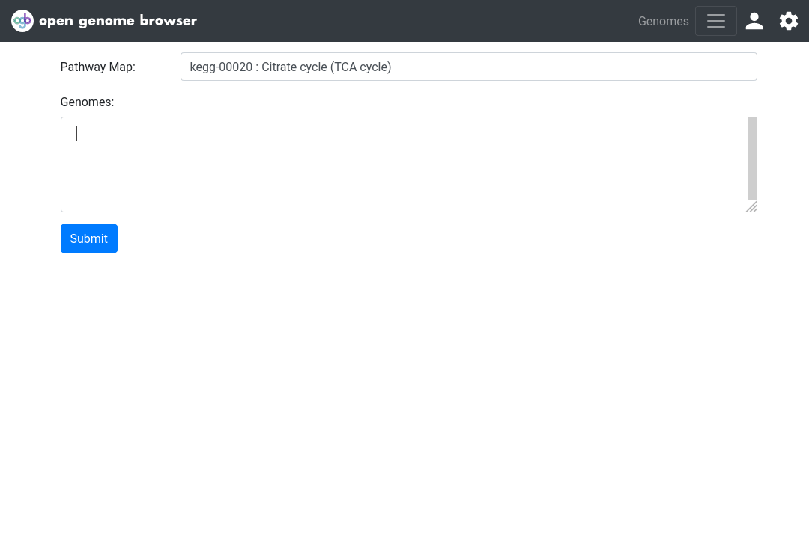

<link rel="shortcut icon" type="image/svg+xml" href="/favicon.svg">

# Select genomes using "magic strings"

Whenever you encounter an input box for genomes, e.g. for a BLAST search or pathway analysis, you can use
_magic strings_ to facilitate the selection of groups of genomes.

All _magic strings_ start with an asterisk.

For example, to select all* genomes that belong to the genus `Lactobacillus`, enter
`@taxgenus:Lactobacillus`.

Alternatively, if the taxonomic class is unknown, `@tax:Lactobacillus` can be used to give the same result. Note: problems may arise if multiple
taxonomic classes have the same name.

If certain genomes are tagged, `@tag:<tag>` can be used, for example `@tag:anaerobe`.

Examples:

- select all* genomes: `@tax:root` (all NCBI taxids belong to this `root` taxid)
- select all* bacterial genomes: `@tax:Bacteria`
- select all* Lacticaseibacillus casei genomes: `@tax:Lacticaseibacillus casei`
- select all* genomes that are tagged as anaerobe: `@tag:anaerobe`

### (*) Important:

_Magic strings_ only return...

- one genome per organism (the _representative_ genome)
- non-contaminated genomes
- non-restricted genomes

Click on `Show query` to see the current selection of genomes.

