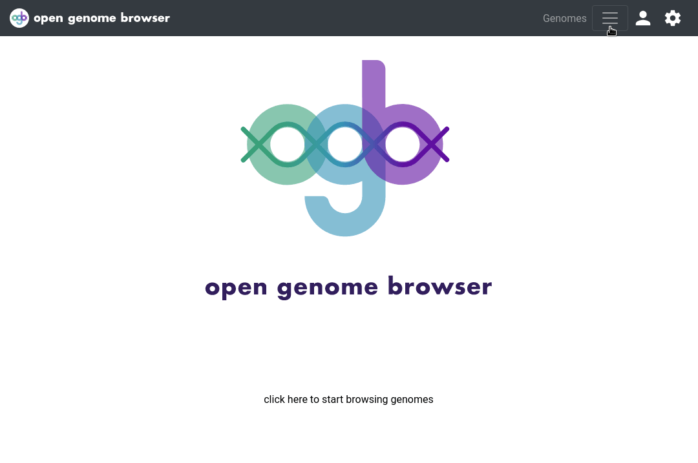

<link rel="shortcut icon" type="image/svg+xml" href="/opengenomebrowser/favicon.svg">

# Pathway Analysis

The [pathways page](https://opengenomebrowser.bioinformatics.unibe.ch/pathway/) allows coloring biochemical pathways maps according to covered
annotations. It is possible to...

- look at the pathway coverage of single genomes
- compare groups of genomes

## Usage

The [pathways page](https://opengenomebrowser.bioinformatics.unibe.ch/pathway/) can be accessed by a right click on the selection of multiple genomes
the genome table or from the drop-down menu 'Tools' on the top right of the genome table page.

Select a pathway map by entering a search query, for example `citrate cycle`, and selecting a map of interest. On the demo server, all KEGG-maps are
available. Next, select one or more genomes and click on `Submit`.

It is also possible
to [select multiple groups](https://opengenomebrowser.bioinformatics.unibe.ch/pathway/?map=kornec00030&g1=@tax:Lactobacillales&g2=@tax:Propionibacteriales)
of genomes, and to see how they differ.

Click on a shape to learn which genomes cover the contained annotations.

Click on a covered annotation, then on ` Compare the genes of this annotation` to see [sequence alignments or compare the gene loci](compare-genes.md)
.

## Meaning of the colors

- transparent: not covered
- red: covered by all genomes
- yellow-red: covered by some genomes (click on shape to see which!)

If multiple groups are being compared, the shapes are split in as many parts as there are groups. The leftmost color corresponds to first group, etc.

## Advanced usage

The color schema can be changed in the settings sidebar (click on settings wheel in the top right corner).

The data behind the plots can be downloaded via the settings sidebar.

The resulting colored pathway map can be downloaded by clicking on the settings wheel, and then on `Save as PNG`
or `Save as SVG`.
