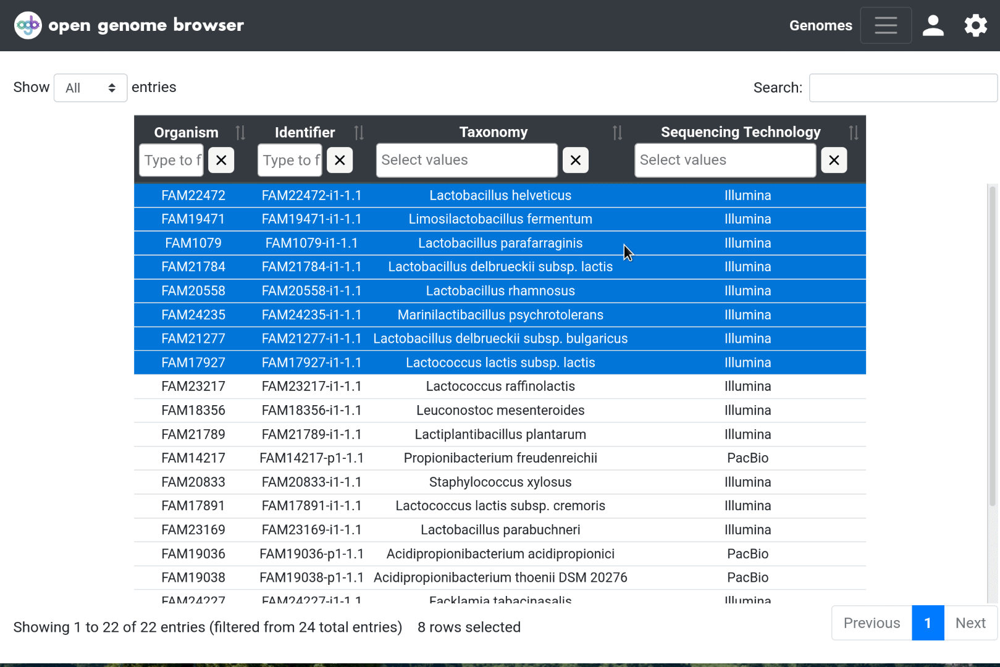

<link rel="shortcut icon" type="image/svg+xml" href="/opengenomebrowser/favicon.svg">

# Phylogenetic Trees

OpenGenomeBrowser can generate and display phylogenetic trees using three distinct algorithms:

- TaxId-based tree: Short calculation time but based on taxid-annotations only (NOT on sequence similarity).
- Genome-similarity-based tree: Short calculation time, based on pairwise comparisons of assemblies (default:
  GenDisCal - PaSiT6 ([Goussarov et al., Bioinformatics, 2020](https://pubmed.ncbi.nlm.nih.gov/31899493/))
- Single-copy-ortholog-based tree (core-genome-based tree): Long calculation time. The methodology is based on
  [OrthoFinder](https://github.com/davidemms/OrthoFinder) consensus tree of all single-copy ortholog
  alignments ([Emms et al., Genome Biology, 2019](https://genomebiology.biomedcentral.com/articles/10.1186/s13059-019-1832-y))

## How to get there

In the [genome table](https://opengenomebrowser.bioinformatics.unibe.ch/genomes), select multiple genomes (using `Shift` and `Ctrl`) and open the
context menu using right click. Then, click on `Show phylogenetic trees`.

## Advanced usage

Through the settings sidebar, it is possible to apply custom colors to the genomes in the tree.

Copy on the newick string to copy the dendrogram, for example to use it in other tools (e.g. [phylo.io](https://phylo.io/) or [itol](https://itol.embl.de/))

Additional downloads:

- For genome-similarity-based trees, download the similarity matrix that was used to calculate the tree by clicking on `Downlad as CSV`
  or `Copy to Clipboard`)
- For single-copy-ortholog-based trees, download the full OrthoFinder output by clicking on `Download as .tar.xz`. If this option is not available,
  click on `Reload OrthoFinder` to regenerate the file.
